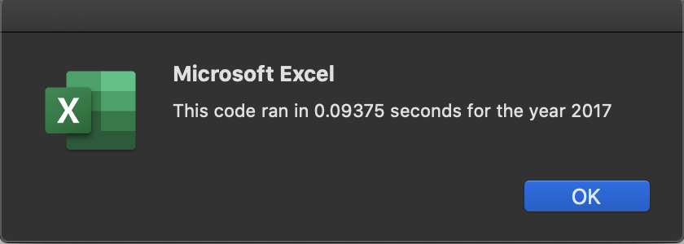
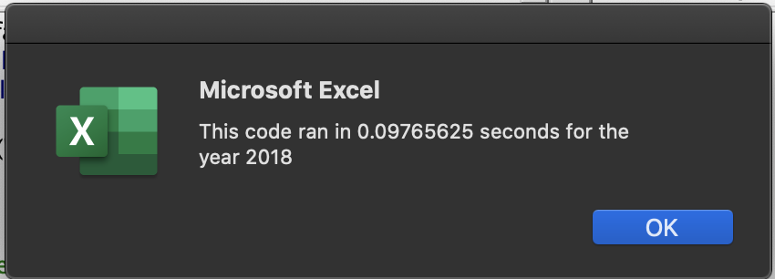

# stock-analysis
Stock Analysis for DQ
##Overview of Project
This project is to refactor the original code written for Steve to ensure it runs more efficiently and can be run for thousands of rows without any issues.

##Results

###Stock Results
Overall, 2017 seems to be a much better year for stocks than 2018. In 2017, only one stock ended the year at a loss. That stock was TERP. The top two performing stocks that year were DQ and SEDG; with both nearing the 200% gains mark. In 2018, however, it appears as though stocks took a hit. There were only two stocks that finished the year with a positive return, and those are ENPH and RUN. As a result, it appears that ENPH and RUN are the safest two stocks to invest in.

###Refactoring the Code
The original code did not use variables for total volume, starting price and ending price. This made the software use a formula to determine the ticker as a string and compute the return and stock volume within a for and if nest. In this code, we set arrays for the start and end prices of each stock for the year, as well as an array for the volume. These arrays referenced an index value that was set for each stock. Running the program took approximately 0.01 seconds for both 2017 and 2018 years.

## Summary

### Refactoring Code Pros and Cons

Refactoring a code generally comes many advantages, as well as some disadvantages. Advantages include performance improvement, additional efficiency aesthetic improvement, as well as making it more understandable should a third party explore this program. It could also help make the author understand the program better if they had not looked at it in a long time. Disadvantages of refactoring include that it could take a long amount of time, depending on the code. It also does not change the purpose of the code, which means nothing is added to the results or inputs.

### Refactoring this Code

This specific refactored script allowed us to gain significant time in performance. The original code ran in approximately 0.5 seconds, while the new code ran in 0.1 seconds. This is a time savings of 80%. This could translate into much longer savings in seconds depending on the size of the prorgam. Being able to refactor this program means that if he was data in the tens of thousands of rows, we could run the program in much less time due do the efficiency gained from refactoring. 

